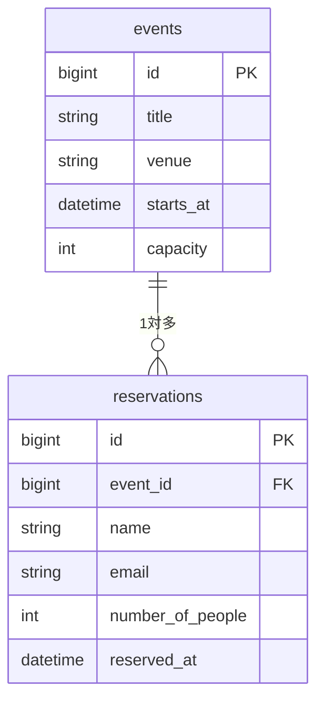
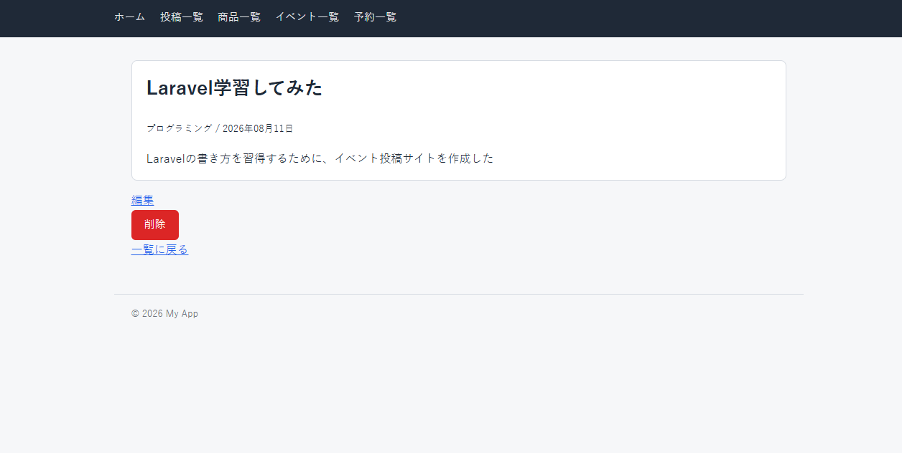

# laravel-docker-app

Laravel 12 + Docker で構築した学習用 Web アプリケーションです。
MVC パターンの練習として、**ブログ**・**商品管理**・**イベント予約** の3つのシステムを実装しています。

Docker で Nginx・PHP-FPM・MySQL・phpMyAdmin をまとめて起動できるため、ローカルに PHP や MySQL を入れなくても `docker compose up -d` だけで開発環境が立ち上がります。

## 使用技術

- PHP 8.2（PHP-FPM）
- Laravel 12.x
- MySQL 8.0
- Nginx
- phpMyAdmin
- Docker / Docker Compose

---

## 実装機能

### 1. ブログシステム

投稿の CRUD を一通り備えたシンプルなブログです。

| 機能 | 説明 |
| --- | --- |
| 投稿一覧 | 新しい順に表示。1ページ10件のページネーション付き |
| 投稿詳細 | 本文の改行を保持して表示（XSS 対策済み） |
| 投稿作成 | タイトル・内容・カテゴリーを入力 |
| 投稿編集 | 既存の値をフォームに復元して更新 |
| 投稿削除 | 確認ダイアログを挟んで削除 |
| バリデーション | 必須・文字数チェック。エラー時は入力値を保持したまま差し戻し |
| レイアウト継承 | `layouts/app.blade.php` を全画面で `@extends` |

### 2. 商品管理システム

数値項目と選択式カテゴリーを扱う商品マスタです。

| 機能 | 説明 |
| --- | --- |
| 商品一覧 | テーブル形式。価格はカンマ区切り、在庫0は「在庫切れ」と赤字表示 |
| 商品詳細 | 商品名・価格・在庫・カテゴリー・説明を表示 |
| 商品登録 / 編集 / 削除 | CRUD 一式 |
| バリデーション | `FormRequest`（`ProductRequest`）に集約し、登録と編集で共通化 |
| 数値チェック | 価格・在庫は整数かつ 0 以上のみ許可 |
| カテゴリー制限 | モデル定数 `Product::CATEGORIES` の5種からのみ選択可能 |
| 任意項目 | 説明は未入力でも登録可（`nullable`） |

### 3. イベント予約システム

**テーブル間のリレーション**を扱う、3つの中で最も複雑なシステムです。

| 機能 | 説明 |
| --- | --- |
| イベント一覧 | 開催日時順。残席数・満席・開催終了を判定して表示 |
| イベント詳細 | 定員・残席と、そのイベントの予約者一覧を表示 |
| 予約作成 | 名前・メール・人数・予約日時を入力 |
| 予約一覧 | 全イベント横断の予約一覧。イベント名をリンク表示 |
| 予約キャンセル | 確認ダイアログを挟んで削除。残席が自動的に戻る |
| **定員チェック** | 残席を超える人数の予約を拒否（`FormRequest` の `after()` フックで実装） |
| N+1 対策 | 一覧で `with()` / `withSum()` を使い、追加クエリを発生させない |

> イベント自体の登録画面はありません。データはシーダー（`EventSeeder`）から投入します。

---

## 画面一覧

| URL | 機能 |
| --- | --- |
| `/posts` | 投稿一覧 |
| `/posts/create` | 投稿作成フォーム |
| `/posts/{id}` | 投稿詳細 |
| `/posts/{id}/edit` | 投稿編集フォーム |
| `/products` | 商品一覧 |
| `/products/create` | 商品登録フォーム |
| `/products/{id}` | 商品詳細 |
| `/products/{id}/edit` | 商品編集フォーム |
| `/events` | イベント一覧 |
| `/events/{id}` | イベント詳細 |
| `/events/{id}/reservations/create` | 予約フォーム |
| `/reservations` | 予約一覧 |

---

## テーブル定義

### posts（投稿）

| カラム | 型 | NULL | 既定値 | 説明 |
| --- | --- | --- | --- | --- |
| id | bigint unsigned | NO | AUTO_INCREMENT | 主キー |
| title | varchar(200) | NO | | タイトル |
| content | text | NO | | 本文 |
| category | varchar(100) | NO | | カテゴリー |
| created_at | timestamp | YES | NULL | 作成日時 |
| updated_at | timestamp | YES | NULL | 更新日時 |

### products（商品）

| カラム | 型 | NULL | 既定値 | 説明 |
| --- | --- | --- | --- | --- |
| id | bigint unsigned | NO | AUTO_INCREMENT | 主キー |
| name | varchar(100) | NO | | 商品名 |
| price | int unsigned | NO | | 価格（円） |
| description | text | YES | NULL | 説明（任意） |
| stock | int unsigned | NO | 0 | 在庫数 |
| category | varchar(50) | NO | | カテゴリー（食品 / 衣料品 / 家電 / 書籍 / その他） |
| created_at | timestamp | YES | NULL | 作成日時 |
| updated_at | timestamp | YES | NULL | 更新日時 |

### events（イベント）

| カラム | 型 | NULL | 既定値 | 説明 |
| --- | --- | --- | --- | --- |
| id | bigint unsigned | NO | AUTO_INCREMENT | 主キー |
| title | varchar(200) | NO | | イベント名 |
| description | text | YES | NULL | 詳細説明 |
| venue | varchar(100) | NO | | 会場 |
| starts_at | datetime | NO | | 開催日時 |
| capacity | int unsigned | NO | | 定員 |
| created_at | timestamp | YES | NULL | 作成日時 |
| updated_at | timestamp | YES | NULL | 更新日時 |

### reservations（予約）

| カラム | 型 | NULL | 既定値 | 説明 |
| --- | --- | --- | --- | --- |
| id | bigint unsigned | NO | AUTO_INCREMENT | 主キー |
| event_id | bigint unsigned | NO | | 外部キー → `events.id`（ON DELETE CASCADE） |
| name | varchar(100) | NO | | 予約者名 |
| email | varchar(255) | NO | | メールアドレス |
| number_of_people | int unsigned | NO | | 人数 |
| reserved_at | datetime | NO | | 予約日時 |
| created_at | timestamp | YES | NULL | 作成日時 |
| updated_at | timestamp | YES | NULL | 更新日時 |

### リレーション



`events` 1件に対して `reservations` が複数紐づきます。
`ON DELETE CASCADE` を設定しているため、イベントを削除すると関連する予約も自動的に削除されます。

Eloquent 側では以下のように定義しています。

```php
// Event.php
public function reservations(): HasMany
{
    return $this->hasMany(Reservation::class);
}

// Reservation.php
public function event(): BelongsTo
{
    return $this->belongsTo(Event::class);
}
```

---

## スクリーンショット

### ブログシステム

| 投稿一覧 | 投稿作成フォーム |
| --- | --- |
|  |  |

| 投稿詳細 | バリデーションエラー |
| --- | --- |
|  |  |

### 商品管理システム

| 商品一覧（在庫切れ表示） | 商品登録フォーム |
| --- | --- |
|  |  |

| 商品詳細 | 数値バリデーション |
| --- | --- |
|  |  |

### イベント予約システム

| イベント一覧（残席表示） | イベント詳細（予約者一覧） |
| --- | --- |
|  |  |

| 予約フォーム | 定員オーバーのエラー |
| --- | --- |
|  |  |

| 予約一覧 |
| --- |
|  |

---

## セットアップ手順

### 1. リポジトリを取得してコンテナを起動

```bash
git clone https://github.com/aoleaf/techmeets-month2.git
cd techmeets-month2
docker compose up -d
```

### 2. 依存パッケージをインストール

`vendor/` は Git 管理外なので、コンテナ内でインストールします。

```bash
docker compose exec app composer install
```

### 3. 環境設定ファイルを作成

```bash
docker compose exec app cp .env.example .env
docker compose exec app php artisan key:generate
```

`.env` の DB 設定を、以下のように MySQL コンテナへ向けます。
`DB_HOST` は `127.0.0.1` ではなく **`db`**（docker-compose のサービス名）です。

```env
DB_CONNECTION=mysql
DB_HOST=db
DB_PORT=3306
DB_DATABASE=laravel
DB_USERNAME=root
DB_PASSWORD=secret
```

### 4. 書き込み権限を設定

```bash
docker compose exec app chown -R www-data:www-data storage bootstrap/cache
docker compose exec app chmod -R 775 storage bootstrap/cache
```

### 5. テーブル作成とサンプルデータ投入

```bash
docker compose exec app php artisan migrate --seed
```

以下のサンプルデータが投入されます。

| データ | 件数 | 内容 |
| --- | --- | --- |
| 投稿 | 15件 | ページネーションの確認用 |
| 商品 | 15件 | 在庫切れ商品を2件含む |
| イベント | 3件 | 定員 30 / 100 / 5 名。定員5名は定員オーバーの確認用 |

### 6. 動作確認

| URL | 内容 |
| --- | --- |
| http://localhost | アプリケーション |
| http://localhost:8080 | phpMyAdmin（root / secret） |

---

## よく使うコマンド

```bash
# コンテナに入る
docker compose exec app bash

# コンテナの停止
docker compose down

# ログの確認
docker compose logs -f app

# DBを作り直してサンプルデータを入れ直す（データは全て消えます）
docker compose exec app php artisan migrate:fresh --seed

# ルート一覧の確認
docker compose exec app php artisan route:list --except-vendor
```

> `php artisan` は必ず **コンテナ内** で実行してください。ホスト側の PHP で実行すると、mbstring 拡張が無い場合に `Call to undefined function mb_split()` エラーになります。

---

## 補足

- Windows のバインドマウント上では `chown` が反映されない場合があります。画面が 500 エラーになるときは `chmod -R 777 storage bootstrap/cache` を試してください。
- `.env` は Git 管理外です。設定を変えたときは `.env.example` 側も更新してください。
- バリデーションのエラーメッセージは、項目名のみ日本語化しています（文章部分は Laravel 標準の英語のままです）。
