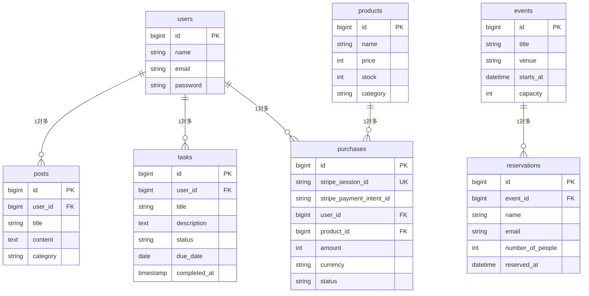

# DB設計

laravel-docker-app のテーブル定義とリレーションです。アプリの概要は [README](../README.md) を参照してください。

## users（ユーザー）

Breeze が生成したマイグレーションのままです。

| カラム | 型 | NULL | 既定値 | 説明 |
| --- | --- | --- | --- | --- |
| id | bigint unsigned | NO | AUTO_INCREMENT | 主キー |
| name | varchar(255) | NO | | 表示名 |
| email | varchar(255) | NO | | メールアドレス（UNIQUE） |
| email_verified_at | timestamp | YES | NULL | メール認証日時 |
| password | varchar(255) | NO | | **bcrypt ハッシュ**（平文は保存しない） |
| remember_token | varchar(100) | YES | NULL | ログイン保持用トークン |
| created_at | timestamp | YES | NULL | 作成日時 |
| updated_at | timestamp | YES | NULL | 更新日時 |

## posts（投稿）

| カラム | 型 | NULL | 既定値 | 説明 |
| --- | --- | --- | --- | --- |
| id | bigint unsigned | NO | AUTO_INCREMENT | 主キー |
| user_id | bigint unsigned | NO | | 外部キー → `users.id`（ON DELETE CASCADE）。投稿の作者 |
| title | varchar(200) | NO | | タイトル |
| content | text | NO | | 本文 |
| category | varchar(100) | NO | | カテゴリー |
| created_at | timestamp | YES | NULL | 作成日時 |
| updated_at | timestamp | YES | NULL | 更新日時 |

## tasks（タスク）

| カラム | 型 | NULL | 既定値 | 説明 |
| --- | --- | --- | --- | --- |
| id | bigint unsigned | NO | AUTO_INCREMENT | 主キー |
| user_id | bigint unsigned | NO | | 外部キー → `users.id`（ON DELETE CASCADE）。タスクの所有者 |
| title | varchar(200) | NO | | タイトル |
| description | text | YES | NULL | 詳細 |
| status | varchar(20) | NO | `'todo'` | 状態。`App\Enums\TaskStatus`（todo / doing / done） |
| due_date | date | YES | NULL | 期限。NULL は期限なし |
| completed_at | timestamp | YES | NULL | 完了日時。`status = done` と必ずセットで更新される |
| created_at | timestamp | YES | NULL | 作成日時 |
| updated_at | timestamp | YES | NULL | 更新日時 |

インデックス：`(user_id, status)` の複合インデックス。
一覧が常に「自分のタスクを状態で絞る」アクセスパターンになるためです。

> `status` と `completed_at` の整合性はアプリ側（`TaskService::complete()` / `reopen()`）で担保しています。
> 汎用の `update()` はこの2カラムを受け付けないため、「完了なのに `completed_at` が NULL」にはなりません。

## products（商品）

| カラム | 型 | NULL | 既定値 | 説明 |
| --- | --- | --- | --- | --- |
| id | bigint unsigned | NO | AUTO_INCREMENT | 主キー |
| name | varchar(100) | NO | | 商品名 |
| price | int unsigned | NO | | 価格（円） |
| description | text | YES | NULL | 説明（任意） |
| stock | int unsigned | NO | 0 | 在庫数 |
| category | varchar(50) | NO | | カテゴリー（食品 / 衣料品 / 家電 / 書籍 / その他） |
| created_at | timestamp | YES | NULL | 作成日時 |
| updated_at | timestamp | YES | NULL | 更新日時 |

## events（イベント）

| カラム | 型 | NULL | 既定値 | 説明 |
| --- | --- | --- | --- | --- |
| id | bigint unsigned | NO | AUTO_INCREMENT | 主キー |
| title | varchar(200) | NO | | イベント名 |
| description | text | YES | NULL | 詳細説明 |
| venue | varchar(100) | NO | | 会場 |
| starts_at | datetime | NO | | 開催日時 |
| capacity | int unsigned | NO | | 定員 |
| created_at | timestamp | YES | NULL | 作成日時 |
| updated_at | timestamp | YES | NULL | 更新日時 |

## reservations（予約）

| カラム | 型 | NULL | 既定値 | 説明 |
| --- | --- | --- | --- | --- |
| id | bigint unsigned | NO | AUTO_INCREMENT | 主キー |
| event_id | bigint unsigned | NO | | 外部キー → `events.id`（ON DELETE CASCADE） |
| name | varchar(100) | NO | | 予約者名 |
| email | varchar(255) | NO | | メールアドレス |
| number_of_people | int unsigned | NO | | 人数 |
| reserved_at | datetime | NO | | 予約日時 |
| created_at | timestamp | YES | NULL | 作成日時 |
| updated_at | timestamp | YES | NULL | 更新日時 |

## purchases（購入履歴）

Stripe Checkout の決済結果を保存します。

| カラム | 型 | NULL | 既定値 | 説明 |
| --- | --- | --- | --- | --- |
| id | bigint unsigned | NO | AUTO_INCREMENT | 主キー |
| stripe_session_id | varchar(255) | NO | | Checkout Session の ID（`cs_...`）。**UNIQUE** |
| stripe_payment_intent_id | varchar(255) | YES | NULL | PaymentIntent の ID（`pi_...`） |
| user_id | bigint unsigned | YES | NULL | 外部キー → `users.id`（ON DELETE SET NULL） |
| product_id | bigint unsigned | YES | NULL | 外部キー → `products.id`（ON DELETE SET NULL） |
| customer_email | varchar(255) | YES | NULL | 決済時のメールアドレス |
| amount | int unsigned | NO | | 金額（JPY はゼロdecimal通貨なので円そのまま） |
| currency | varchar(3) | NO | | 通貨コード（`jpy`） |
| status | varchar(30) | NO | | Stripe の `payment_status`（`paid` など） |
| created_at | timestamp | YES | NULL | 作成日時 |
| updated_at | timestamp | YES | NULL | 更新日時 |

`stripe_session_id` の UNIQUE が**冪等性の要**です。
Stripe の Webhook は同じイベントを複数回配信し得るため、`updateOrCreate` の探索キーに使って
2回目以降を UPDATE に倒し、重複行が生まれないようにしています。

ユーザーや商品が削除されても購入履歴は帳簿として残す必要があるので、
CASCADE ではなく `ON DELETE SET NULL` にしています。

---

## リレーション



`users` 1件に対して `posts` と `tasks` が、`events` 1件に対して `reservations` が複数紐づきます。
いずれも `ON DELETE CASCADE` なので、ユーザーを削除するとその投稿とタスクも一緒に消えます（退会機能で使われます）。

Eloquent 側では以下のように定義しています。

```php
// User.php
public function posts(): HasMany
{
    return $this->hasMany(Post::class);
}

public function tasks(): HasMany
{
    return $this->hasMany(Task::class);
}

// Post.php
public function user(): BelongsTo
{
    return $this->belongsTo(User::class);
}

// Task.php
public function user(): BelongsTo
{
    return $this->belongsTo(User::class);
}

// Event.php
public function reservations(): HasMany
{
    return $this->hasMany(Reservation::class);
}

// Reservation.php
public function event(): BelongsTo
{
    return $this->belongsTo(Event::class);
}

// Purchase.php
public function user(): BelongsTo
{
    return $this->belongsTo(User::class);
}

public function product(): BelongsTo
{
    return $this->belongsTo(Product::class);
}
```
